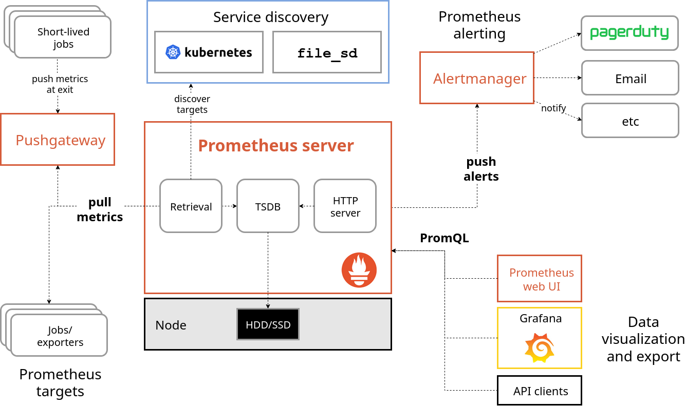

# پرومتئوس (Prometheus)

**اعضای گروه**  
محمد داودآبادی فراهانی - ابوالفضل دانیالی - علیرضا صمیمی

## مقدمه

در سامانه‌های توزیع‌شده و معماری میکروسرویس، مشاهده‌پذیری (Observability) و پایش (Monitoring) برای اطمینان از پایداری و کارایی ضروری است. چالش‌های اصلی عبارت‌اند از:

- جمع‌آوری متریک‌ها با کمترین سربار از سرویس‌ها و زیرساخت

- ذخیره‌سازی بهینه داده‌های سری‌زمانی برای تحلیل روند

- امکان پرس‌وجوی منعطف برای فیلتر، تجمیع و مقایسه متریک‌ها

- تعریف و مدیریت هشدارهای قابل‌نگه‌داری و قابل‌اعتماد

رویکردهای سنتی غالباً فقط بر لاگ‌ها تکیه می‌کنند یا مقیاس‌پذیری و بُعددهی مناسبی ندارند. **Prometheus** برای حل این مسائل با مدل Pull، برچسب‌ها (Labels)، پایگاه‌دادهٔ سری‌زمانی داخلی و زبان **PromQL** ارائه شده است و مشکلات بالا را حل می‌کند.

## معرفی کلی ابزار

- **پرومتئوس** یک جعبه‌ابزار متن‌باز برای **پایش** و **هشدار** است (عضو پروژه‌های CNCF). اجزای اصلی آن شامل موارد زیر است:

- **سرور پرومتئوس**: اسکرپ (Pull) متریک‌ها از اهداف (Targets)، ذخیره‌سازی سری‌زمانی، و ارائهٔ API/UI.

- **اکسپورترها**: در دسترس‌کردن متریک برای سیستم‌ها/سرویس‌هایی که متریک بومی ندارند (مثلاً **Node Exporter**).

- **کتابخانه‌های کلاینت**: ابزاردهی مستقیم برنامه‌ها و اکسپوز کردن مسیر `/metrics`.

- **مدیر هشدار**: مدیریت قوانین هشدار، گروه‌بندی و ارسال به کانال‌هایی مانند Email/Slack.

- **مشاهده در قالب نمودار**: معمولاً از **Grafana** برای ساخت داشبوردهای متریک استفاده می‌شود.

- **مدل داده**: در Prometheus گروه بندی داده‌ها بر پایهٔ سری‌هایی با **نام متریک** و مجموعه‌ای از **Label**هاست (مانند `instance`، `job`).
- **زبان PromQL**: امکان فیلتر، تجمیع، محاسبهٔ نرخ و سایر توابع تحلیلی را فراهم می‌کند.



## انواع متریک‌ها در Prometheus

متریک‌ها در Prometheus یکی از چهار نوع زیر را دارند.

- **شمارنده (Counter)** – فقط افزایش می‌یابد (مثل تعداد درخواست‌ها)  
- **سنجنده (Gauge)** – کم و زیاد می‌شود (مثل حافظه مصرفی)  
- **خلاصه (Summary)** – مجموع و تعداد مشاهدات
- **هیستوگرام (Histogram)** – توزیع مقادیر در بازه‌ها

## مثال ساده

هدف: جمع‌آوری متریک‌های سیستمی از یک ماشین و کوئری‌کردن آن‌ها در واسط کاربری Prometheus.

### پیش‌نیاز

نصب بودن Docker و Docker Compose

### فایل پیکربندی `prometheus.yml`

در یک پوشهٔ جدید، فایل زیر را ایجاد کنید:

```yaml
global:
  scrape_interval: 15s

scrape_configs:
  - job_name: "node"
    static_configs:
      - targets: ["node-exporter:9100"]
```

### اجرای Prometheus و Node Exporter با Docker

فایل `docker-compose.yml` را کنار پیکربندی بالا بسازید:

```yaml
services:
  prometheus:
    image: prom/prometheus:latest
    container_name: prometheus
    volumes:
      - ./prometheus.yml:/etc/prometheus/prometheus.yml:ro
    ports:
      - "9090:9090"

  node-exporter:
    image: prom/node-exporter:latest
    container_name: node-exporter
    ports:
      - "9100:9100"
```

سپس سرویس‌ها را بالا بیاورید:

```bash
docker compose up -d
```

### مشاهده و کوئری در UI

مرورگر را باز کنید و به `http://localhost:9090` بروید.  
در تب **Graph** کوئری‌های نمونهٔ زیر را اجرا کنید:
  بررسی سلامت سرویس:

```promql
up{job="node"}
```

  نرخ استفادهٔ CPU در بازهٔ ۵ دقیقه:

```promql
rate(node_cpu_seconds_total[5m])
```

برای توقف سرویس‌ها:

```bash
docker compose down
```

## منابع

- <https://prometheus.io/docs/introduction/overview/>
- <https://prometheus.io/docs/prometheus/latest/getting_started/>
- <https://prometheus.io/docs/prometheus/latest/querying/basics/>
- <https://prometheus.io/docs/instrumenting/exporters/>
- <https://github.com/prometheus/node_exporter>
- <https://prometheus.io/docs/alerting/latest/overview/>
- <https://grafana.com/docs/grafana/latest/datasources/prometheus/>
